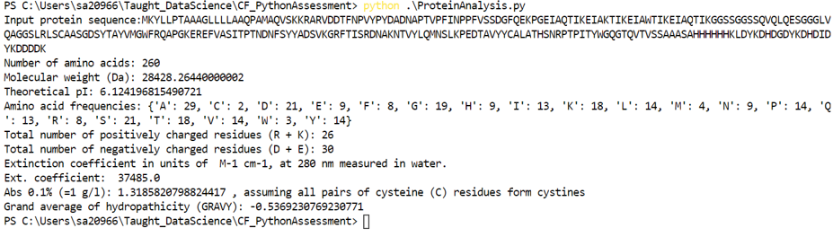

# Protein Analysis Tool (README) #

## Description ##

ProteinAnalysis.py functions as a protein analysis tool. It generates a number of physical and chemical parameters
for a given protein, which can be deduced solely from the amino acid sequence. These are:

* Protein length
* Molecular weight
* Theoretical isoelectric point (pI)
* Amino acid composition
* Extinction coefficients
* GRAVY (Grand Average of Hydropathicity)

## Useage ##

#### To run:

* Download the ProteinAnalysis.py script and sample data (SAMPLEDATA_ADAH11Penta1.txt) in this repository and store in a working directory.
* When prompted (example terminal shown below), enter sample protein sequence via copying and pasting sequence from sample data file.

* Graphs are generated in pop-out windows. These windows must be closed before the remaining code will run.
* Once the script has finished running, it should resemble the example terminal shown below.

#### Input requirements:

* Only protein sequences in single-letter amino acid are accepted.
* Only one sequence may be entered at a time.
* There is no limit on protein size.

## Notes on parameter calculations:

Molecular weight and pI are calculated using the ProteinAnalysis function within Biopython (Documentation available
at: https://biopython.org/wiki/ProtParam).

Extinction coefficients are generated using the calculations from the Expasy Proteomics Server (Documentation
available at: https://web.expasy.org/protparam/protparam-doc.html; Citation: Gasteiger, E., Hoogland, C., Gattiker,
A., Wilkins, M.R., Appel, R.D. and Bairoch, A., 2005. Protein identification and analysis tools on the ExPASy
server. In: The proteomics protocols handbook(pp. 571-607). Humana press.)

The GRAVY (Grand Average of Hydropathicity) value for a protein is calculated as the mean hydropathicity value of
all its amino acids (Documentation available at: https://web.expasy.org/protscale/pscale/Hphob.Doolittle.html;
Citation: Kyte, J. and Doolittle, R.F., 1982. A simple method for displaying the hydropathic character of a
protein. Journal of molecular biology, 157(1), pp.105-132).

